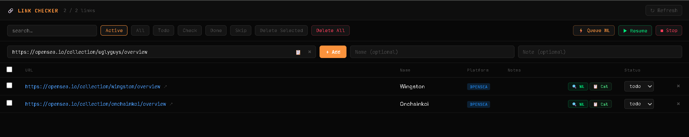
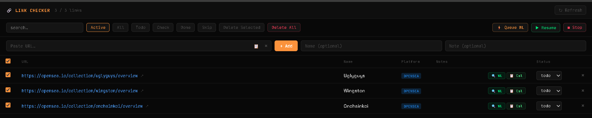
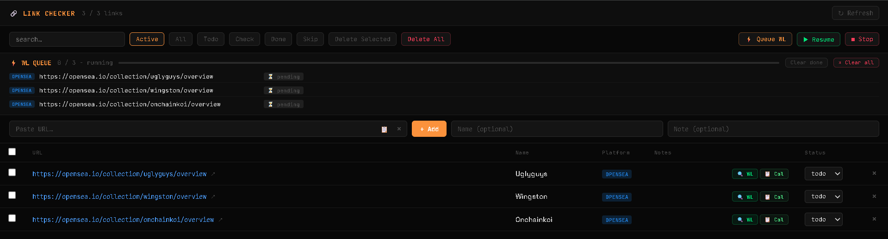

# Bulk Checker

## Overview

Bulk Checker is used when you want to check multiple collection URLs in sequence.

Paste each collection URL, add it to the list, select the collections you want to check, and queue the allowlist checks.

## Workflow

1. Paste a collection URL and click **Add**.
2. Select the collections you want to check.
3. Click **Queue WL**.
4. Leave the Bulk Checker tab open while the queue runs.
5. Return to MintPad when the queue is running.
6. Calendar updates automatically when checker results are created.
7. If needed, refresh the UI manually.

## Step 1 — Add Collection URLs

1. Paste the collection URL into the URL field.
2. Optionally add a name or note.
3. Click **Add**.
4. Repeat this step for every collection you want to check.

## Step 2 — Select Collections and Queue WL

1. Select the collections you want to check.
2. Click **Queue WL**.
3. MintPad adds the selected collections to the allowlist checking queue.

## Step 3 — Leave the Queue Running

After the queue starts, you can return to MintPad.

Keep the Bulk Checker tab open while the queue is running.

MintPad will process the selected collections and create checker results.

When results are created, the Calendar updates automatically.

If the UI does not update immediately, use **Refresh**.

## Notes

**Tip:** Use Bulk Checker when checking multiple OpenSea collection URLs.

**Note:** Queue time depends on the number of collections and the number of wallets.

**Note:** Keep the browser tab open while the queue is running.

## Related Pages

- Check Allowlist and Mint
- Calendar
- OpenSea
