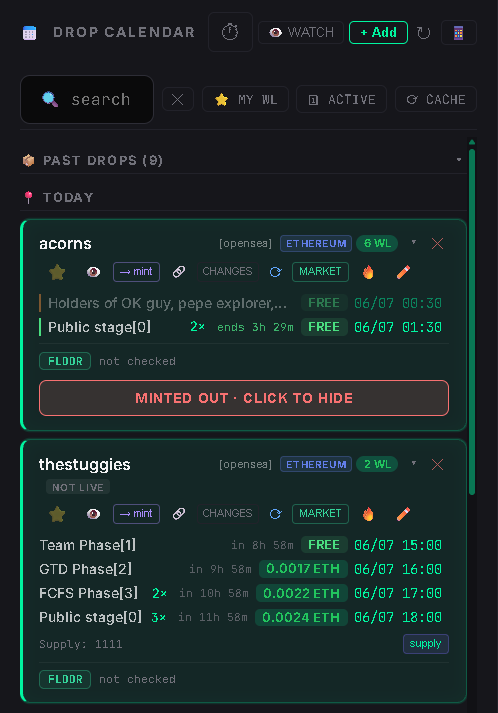
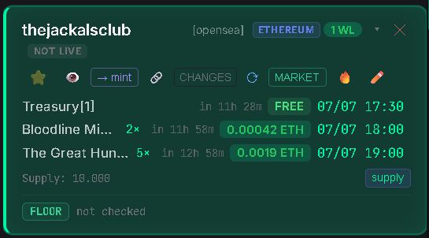

# Calendar

## Overview

The Calendar is the central workspace for monitoring upcoming drops and launching mint workflows.

After every successful Allowlist Checker or Bulk Checker run, MintPad automatically creates or updates the corresponding Calendar card.

Each card displays:

- Collection name
- Platform
- Blockchain
- WL status
- Mint phases
- Mint prices
- Mint schedule

## Workflow

1. Run an Allowlist Checker or Bulk Checker.
2. Wait for the Calendar to refresh automatically.
3. Review the generated drop card.
4. Click **→ Mint** (or the platform button) to open the correct mint bot.
5. Create your mint tasks.

## Step 1 — Calendar Overview

The Calendar automatically sorts drops by date and time.

Use the search box to quickly find collections or platforms.

Past drops remain available until hidden.

## Step 2 — Drop Card

A Calendar card provides quick access to the most common actions.

Available actions include:

- Open Mint
- Timeline view
- WL information
- Change detection
- Watch mode
- MARKET
- Supply
- Floor / Volume
- Hide card

If change notifications are triggered, it is recommended to run the Allowlist Checker again or refresh the drop.

## Notes

- Calendar refreshes automatically after successful checker results.
- Use the Timeline button to switch to the phase timeline view.
- Use Search to quickly locate drops.
- Hide sold out drops when they are no longer needed.

## Related Pages

- Check Allowlist and Mint
- Bulk Checker
- MARKET
