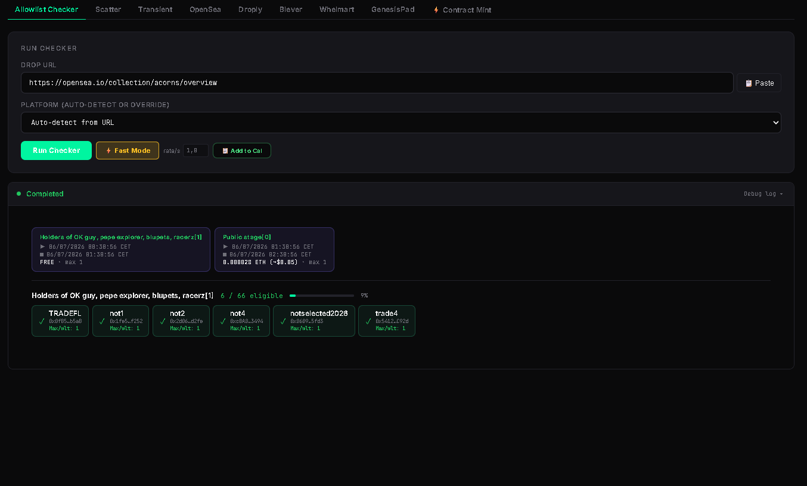
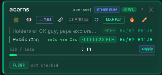
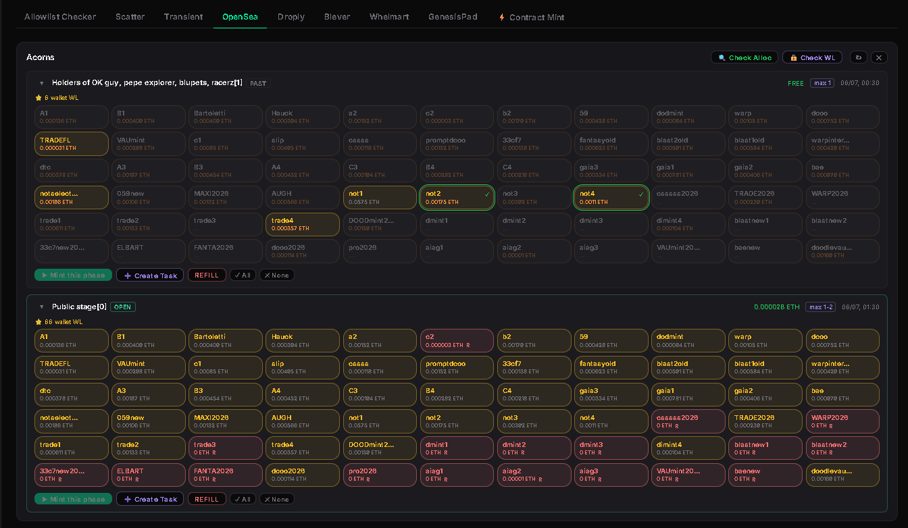

# Check Allowlist and Mint

## Overview

This workflow starts from an OpenSea collection URL, checks wallet eligibility, updates the Calendar, and loads the eligible mint phase into the appropriate mint bot.

## Workflow

1. Start from an **OpenSea collection URL**.
2. Run **Allowlist Checker**.
3. Review the generated **Calendar Card**.
4. Open the **Mint Allocation View**.
5. Select eligible wallets and **Create Tasks**.
6. Launch the **Live Mint** when the phase opens.

## Step 1 — Run the Allowlist Checker

1. Copy the OpenSea collection URL.
2. Open **Allowlist Checker**.
3. Paste the collection URL.
4. Leave **Platform** on **Auto Detect** or select a platform manually if needed.
5. Enable **Fast Mode** if desired.
6. Click **Run Checker**.
7. Wait for the wallet scan to complete.

After the scan finishes, MintPad:

- displays eligible wallets
- detects available mint phases
- generates the checker CSV
- automatically refreshes the Calendar

## Step 2 — Review the Calendar Card

The Calendar is automatically updated using the checker results.

The Calendar card contains:

- detected mint phases
- mint price
- phase schedule
- eligible wallets
- wallet mint limits
- quick actions

From the Calendar you can also:

- monitor collection changes
- receive notifications if configured
- open MARKET
- launch the mint workflow with one click

## Step 3 — Open the Mint Allocation View

Click the **Mint** action from the Calendar card.

MintPad opens the matching mint platform and automatically loads the allocation view.

From here you can:

1. Review eligible wallets.
2. Check wallet mint limits.
3. Select the wallets to use.
4. Create mint tasks.
5. Launch the live mint when the phase opens.

## Notes

**Tip:** Fast Mode is recommended when checking large wallet sets.

**Note:** Wallet eligibility depends on the current allowlist snapshot returned by the platform.

**Note:** Every successful checker automatically refreshes the Calendar, so there is no need to import results manually.

## Related Pages

- Calendar
- OpenSea
- Bulk Checker
- Transaction Monitor
