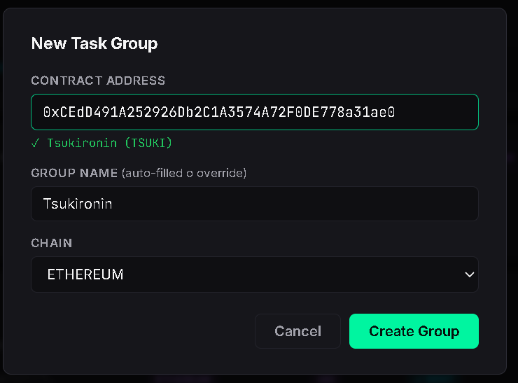
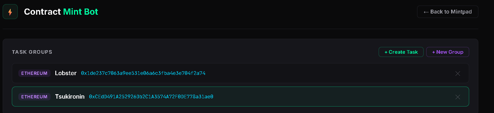
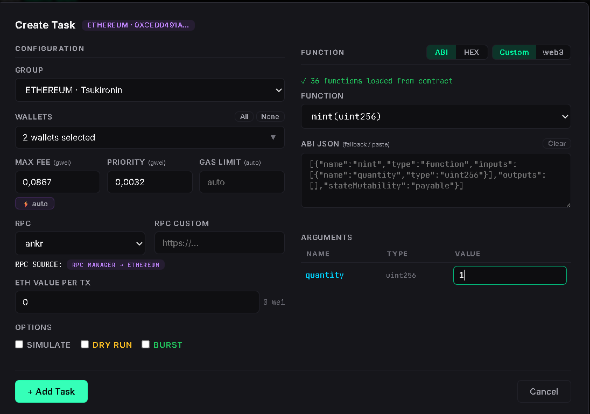
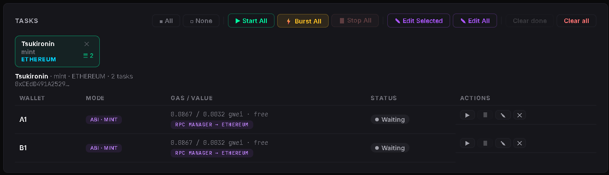

# Contract Mint

## Overview

Contract Mint allows you to interact directly with Ethereum-compatible smart contracts.

It can be used for NFT mints that expose a public contract, even when a dedicated platform integration is not available.

MintPad can load verified contract ABIs through Etherscan when available and lets you create multi-wallet mint tasks from a graphical interface.

## Before You Start

Before using Contract Mint for the first time, configure an **Etherscan API Key** in **Settings → Runtime Keys**.

The API key is used to retrieve verified contract ABIs.

If no API key is configured, MintPad may prompt you when required.

## Workflow

1. Paste the contract address.
2. Create a contract group.
3. Select the contract.
4. Create mint tasks.
5. Unlock the Wallet Vault.
6. Start the tasks with **Burst All** or **Start All**.

## Step 1 — Create a Contract Group

1. Click **New Group**.
2. Select the blockchain.
3. Paste the contract address.
4. MintPad detects the collection name when available.
5. Click **Create Group**.

## Step 2 — Select the Contract

The contract group now appears inside the Contract Mint workspace.

Select the contract you want to mint and click **Create Task**.

## Step 3 — Configure the Mint Task

On the right side:

- Select the contract function, usually `mint`.
- Fill the function arguments exactly as you would on Etherscan **Write Contract**.

On the left side:

- Select the wallets.
- Configure gas manually or use automatic gas.
- Choose the RPC source.
- Enable optional task settings if needed.

Click **Add Task**.

## Step 4 — Unlock the Vault and Start Minting

Before starting any mint task, make sure the Wallet Vault is unlocked.

Transaction signing requires an unlocked Vault.

After unlocking the Vault:

1. Select the task group.
2. Click **Burst All** to start all wallets in parallel.
3. Or click **Start All** to execute tasks sequentially.

**Burst All** is generally recommended for competitive NFT mints where execution speed is important.

MintPad monitors submitted transactions until completion.

## Notes

**Note:** Contract Mint supports verified smart contracts that expose callable functions through their ABI.

**Note:** Wallet selection, RPC selection and gas configuration can be customized for each task.

**Note:** The Wallet Vault must be unlocked before MintPad can sign blockchain transactions.

## Related Pages

- Runtime Keys
- RPC Manager
- Transaction Monitor
- Vault Overview
