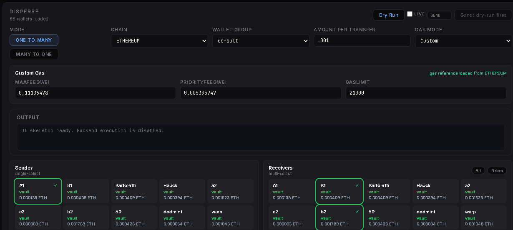
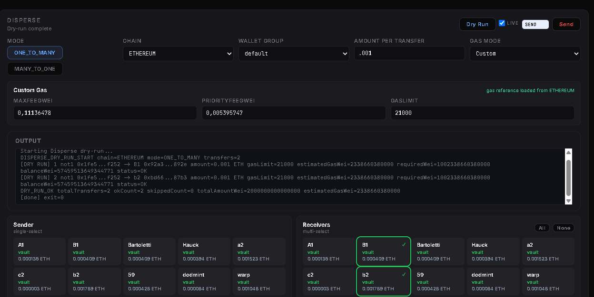
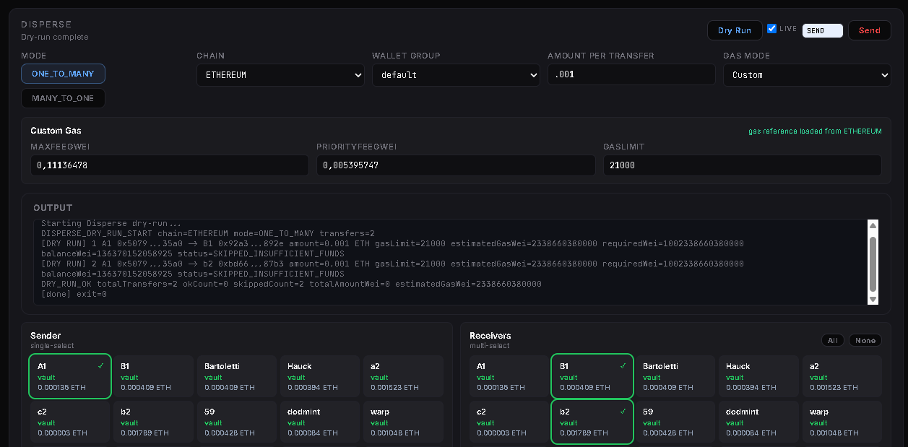
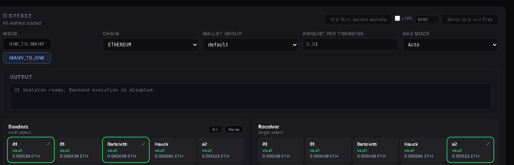

# Disperse & Consolidate

## Overview

Disperse & Consolidate is used to move native tokens between multiple wallets.

Use **ONE_TO_MANY** when sending funds from one wallet to multiple receivers.

Use **MANY_TO_ONE** when consolidating funds from multiple sender wallets into one receiver wallet.

Before sending any transaction, unlock the Wallet Vault.

## Workflow

1. Unlock the Wallet Vault.
2. Select the transfer mode.
3. Select sender and receiver wallets.
4. Enter the amount per transfer.
5. Configure gas.
6. Run **Dry Run**.
7. Review the output log.
8. If the dry run is successful and `skipped=0`, type **SEND**.
9. Click **Send**.

## Step 1 — Prepare ONE_TO_MANY

For **ONE_TO_MANY**:

1. Select **ONE_TO_MANY** mode.
2. Select the chain.
3. Select the wallet group.
4. Select one sender wallet.
5. Select two or more receiver wallets.
6. Enter the amount to send to each receiver.
7. Configure gas.

If you arrive from a REFILL or allocation workflow, the receiver wallets may already be selected.

## Step 2 — Run Dry Run and Check the Log

Click **Dry Run** before sending.

Review the output log carefully.

A successful dry run should show:

- the selected transfers
- estimated gas
- `DRY_RUN_OK`
- `skippedCount=0`

If everything is correct, enable **LIVE**, type **SEND** into the confirmation field, and click **Send**.

## Step 3 — Handle Failed Dry Runs

If the dry run reports skipped transfers, do not send.

Common reasons include:

- insufficient funds
- invalid sender or receiver selection
- wrong amount
- incorrect gas configuration

Fix the issue and run **Dry Run** again before sending.

If the Vault was not unlocked before sending, unlock the Vault and repeat the workflow from **Dry Run** onward.

## Step 4 — Consolidate with MANY_TO_ONE

For **MANY_TO_ONE**:

1. Select **MANY_TO_ONE** mode.
2. Select the chain.
3. Select the wallet group.
4. Select two or more sender wallets.
5. Select one receiver wallet.
6. Enter the amount each sender should transfer.
7. Configure gas.
8. Run **Dry Run**.
9. If the dry run is successful and `skipped=0`, type **SEND** and click **Send**.

## Notes

**Warning:** Always run **Dry Run** before sending live transactions.

**Warning:** Do not send if the output log shows skipped transfers or insufficient funds.

**Note:** Disperse currently uses native tokens only.

**Note:** The Wallet Vault must be unlocked before MintPad can sign and send transactions.

## Related Pages

- Vault Overview
- RPC Manager
- Transaction Monitor
- Check Allowlist and Mint
