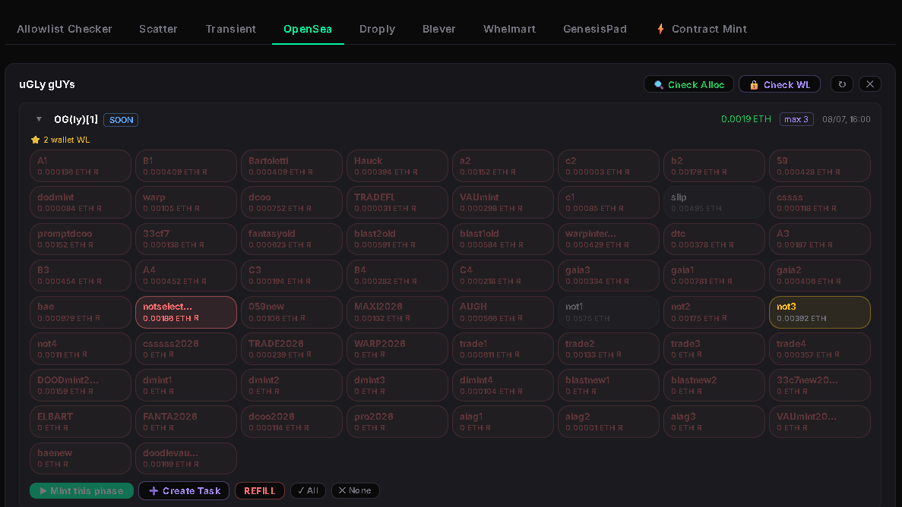
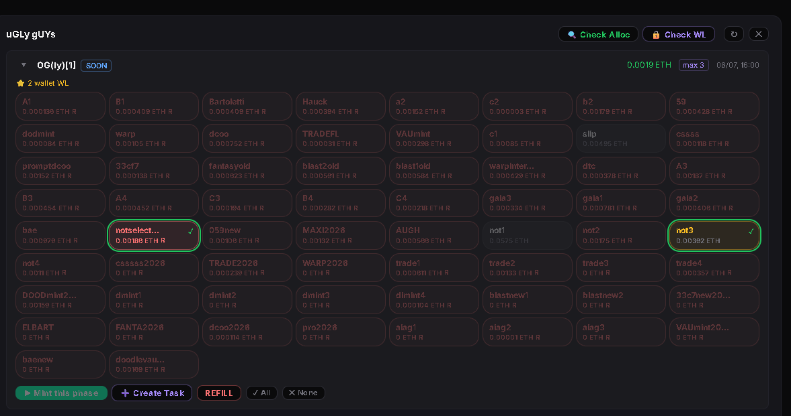
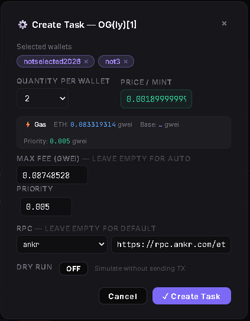
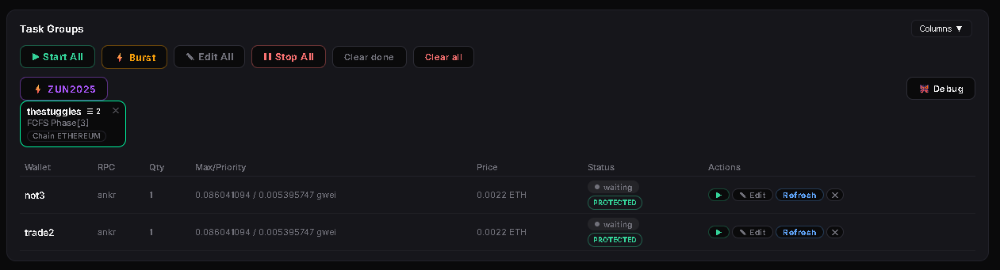

# OpenSea Mint

## Overview

OpenSea Mint is used to create and run mint tasks from an OpenSea allocation view.

The usual entry point is the Calendar card. Click **→ Mint** from a drop card and MintPad opens the OpenSea tab with the allocation view already loaded.

## Workflow

1. Open the drop from the Calendar using **→ Mint**.
2. Review the allocation view.
3. Select eligible wallets.
4. Create mint tasks.
5. Unlock the Wallet Vault.
6. Start the task group with **Burst** or **Start All**.
7. Monitor transactions and accelerate if needed.

## Step 1 — Review the Allocation View

The allocation view shows all detected mint phases and all wallets.

Wallet colors indicate their current state:

- Eligible wallets are active.
- Non-eligible wallets are dimmed.
- Wallets with enough balance appear ready for selection.
- Wallets below the required mint price may appear highlighted as insufficient balance.

If an eligible wallet does not have enough funds, select it and use **REFILL** to open Disperse with the wallet already selected as a receiver.

## Step 2 — Select Wallets

Select the eligible wallets you want to use for the mint.

Before creating tasks, review:

- selected phase
- mint price
- wallet balance
- wallet mint limit
- number of wallets selected

Click **Create Task**.

## Step 3 — Create Mint Tasks

In the task creation modal:

1. Confirm the selected wallets.
2. Confirm the quantity per wallet.
3. Verify the mint price.
4. Configure gas.
5. Select the RPC.
6. Click **Create Task**.

Always check the mint price carefully before creating tasks.

## Step 4 — Run the Task Group

After tasks are created, open the task group view.

Before starting, make sure the Wallet Vault is unlocked.

Use:

- **Burst** to start tasks in parallel.
- **Start All** to start tasks sequentially.

OpenSea tasks may include price protection.

If a project changes the mint price unexpectedly, for example from free to paid, a protected task will not launch the transaction.

## Transaction Monitoring

OpenSea Mint supports transaction tracking and acceleration.

Use transaction tracking to monitor whether submitted transactions succeed or fail.

Use acceleration when a pending transaction needs to be sped up.

## Check Allocation

Use **Check Alloc** to refresh the allocation view and update real wallet limits.

This is useful after minting.

For example:

- if a wallet has already reached its mint limit, MintPad disables it
- if a wallet can still mint more, MintPad keeps it active
- if a wallet minted one out of two allowed NFTs, MintPad can show that partial usage

## Notes

**Warning:** Always verify the mint price before creating tasks.

**Warning:** Unlock the Vault before starting tasks.

**Note:** Check Alloc works by checking wallet holdings for the collection. If you mint and sell before running Check Alloc, the result may not reflect the original mint usage correctly.

**Note:** Use REFILL when eligible wallets do not have enough ETH for mint price and gas.

## Related Pages

- Check Allowlist and Mint
- Calendar
- Disperse & Consolidate
- Transaction Monitor
