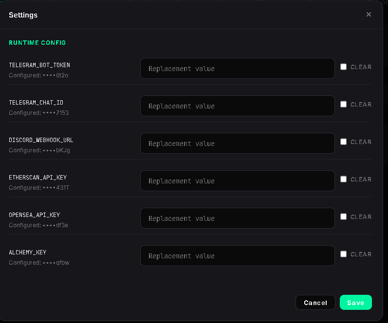

# Runtime Settings

## Overview

The Settings modal is used to configure optional runtime keys used by MintPad features.

Open Settings from the gear button in the top toolbar.

Runtime keys are stored locally in MintPad configuration. They are optional and only required for the features that use them.

## Runtime Keys

The Settings modal supports the following values:

- **TELEGRAM_BOT_TOKEN** — used for Telegram notifications.
- **TELEGRAM_CHAT_ID** — target Telegram chat for notifications.
- **DISCORD_WEBHOOK_URL** — used for Discord notifications.
- **ETHERSCAN_API_KEY** — used by Contract Mint for contract lookup and ABI loading.
- **OPENSEA_API_KEY** — used by MARKET and MyBags.
- **ALCHEMY_KEY** — used by MARKET and MyBags.

## Updating a Key

1. Open **Settings**.
2. Find the key you want to update.
3. Enter the new value in the **Replacement value** field.
4. Click **Save**.

Configured values are masked in the UI.

## Clearing a Key

To remove a configured value:

1. Enable **Clear** for that key.
2. Click **Save**.

## Notes

**Note:** Telegram and Discord configuration is optional and only needed if you want notification delivery.

**Note:** Etherscan is recommended for Contract Mint.

**Note:** OpenSea and Alchemy are recommended for MARKET and MyBags.

## Related Pages

- Contract Mint
- Calendar
- MARKET
- MyBags
